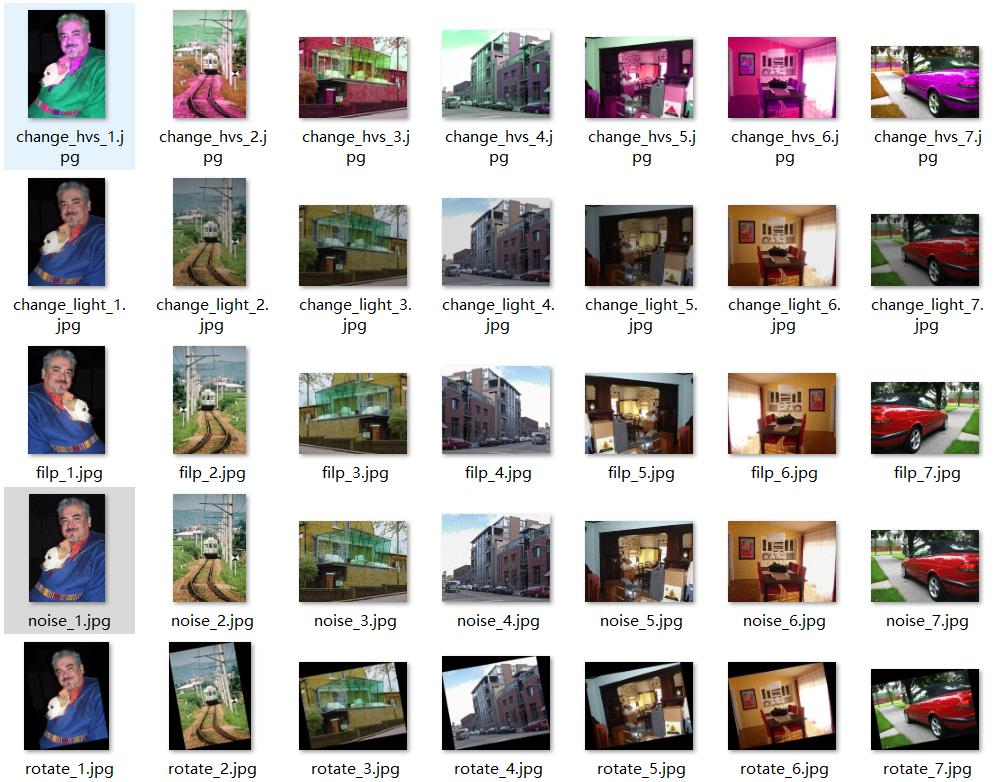

# 对PASCAL VOC 数据集进行数据增强

### 1.GitHub仓库位置

目的：对VOC数据集的对象检测的数据进行数据增强。**如果能帮到您请给本人一颗⭐，拜托了！！！！！**

https://github.com/Mygithub-Yao/tools-VOC

### 2.项目目录解析

```
DataAugmentLabelImg   //增强功能代码
show_picture         //readme.md文件用的的图片
TestData			//测试数据集
Augment_scripy.py          //脚本代码
README.md
```

### 3.使用script对数据集增强

#### 3.1获取帮助

```
python Augment_script.py -h
```

显示结果：

```
usage: Augment_script.py [-h] [--root ROOT_PATH] [--xmlpath XMLPATH]
                         [--imgpath IMGPATH] [--hub HUB] [--sat SAT]
                         [--val VAL] [--rotate ROTATE] [--Noise NOISE]
                         [--changeLight CHANGELIGHT] [--filp FILP]

aug dataset

optional arguments:
  -h, --help            show this help message and exit
  --root ROOT_PATH      dataset root path
  --xmlpath XMLPATH     自定义xml文件位置,默认是数据集根目录下生成新的文件夹
  --imgpath IMGPATH     自定义img文件位置,默认是数据集根目录下生成新的文件夹
  --hub HUB             hub调节,范围0~180
  --sat SAT             饱和度变化比例调节,范围0~2
  --val VAL             明度变化比例调节,范围0~2
  --rotate ROTATE       旋转角度
  --Noise NOISE         添加高斯噪音
  --changeLight CHANGELIGHT
                        随机光度调节
  --filp FILP           水平翻转
```

#### 3.2增强例子

**hvs调节**

```shell
python Augment_script.py --hub=30 --sat=1.2 --val=1.2  --root=./TestData/VOC
```

**随机亮度调节**

```shell
python Augment_script.py --changeLight=True --root=./TestData/VOC
```

**高斯噪点**

```
python Augment_script.py --Noise=True --root=./TestData/VOC
```

**旋转指定角度**

```
python Augment_script.py --rotate=10 --root=./TestData/VOC
```

**水平翻转**

```
python Augment_script.py --filp=True --root=./TestData/VOC
```

**结果展示：**


